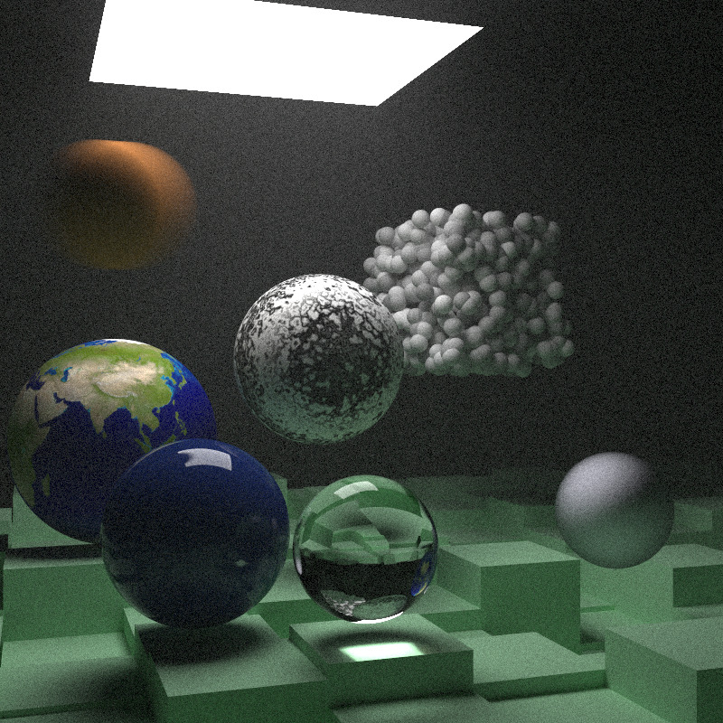

# Ray Tracing in One Weekend

A rust implemented with reference to [Ray Tracing in One Weekend](https://raytracing.github.io/books/RayTracingInOneWeekend.html).

## Run

To get a list of available examples, run a command that doesn't specify any examples.

```bash
cargo run --release --example
# You will get a output like this:
#
# Available examples:
#    book1_final_demo
#    book2_final_demo
#    checker_texture_demo
#    cornell_box_demo
#    earth_demo
#    lights_demo
#    material_camera_demo
#    perlin_noise_demo
#    quad_demo
```

Pick a specify example and run:

```bash
cargo run --release --example cornell_box_demo
```

>`--release` is recommended, because it really speeds up the render process.

## Overview

### Ray Tracing In One Weekend

</img>

### Ray Tracing The Next Week

</img>

### Ray Tracing The Rest of Your Life

todo...
