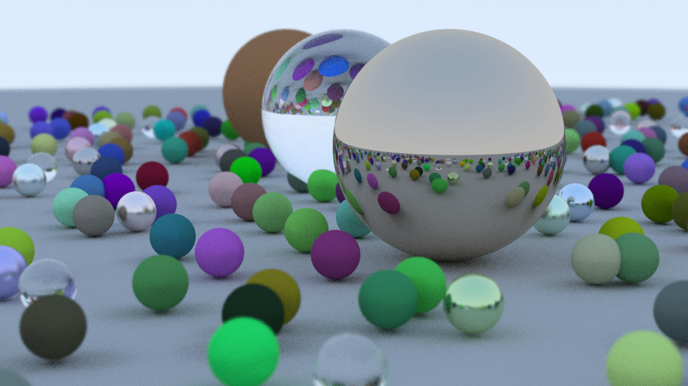

# tiny_raytracer

A rust tiny raytracer implemented with reference to [Ray Tracing in One Weekend](https://raytracing.github.io/books/RayTracingInOneWeekend.html).

## Run

This project don't provide a bin target, so you can't just run:

```bash
cargo run
cargo run --release
```

But there are some example targets, to get a list of available examples, run a command that doesn't specify any examples.

```bash
cargo run --release --example
# You will get a output like this:
#
# Available examples:
#    book1_final_demo
#    checker_texture_demo
#    earth_demo
#    material_camera_demo
#    perlin_noise_demo
```

Pick and run a specify example:

```bash
cargo run --release --example book1_final_demo
```

>`--release` is recommended, because it really speeds up the render process.

## Overview

### Ray Tracing In One Weekend



### Ray Tracing The Next Week

todo...

### Ray Tracing The Rest of Your Life

todo...
