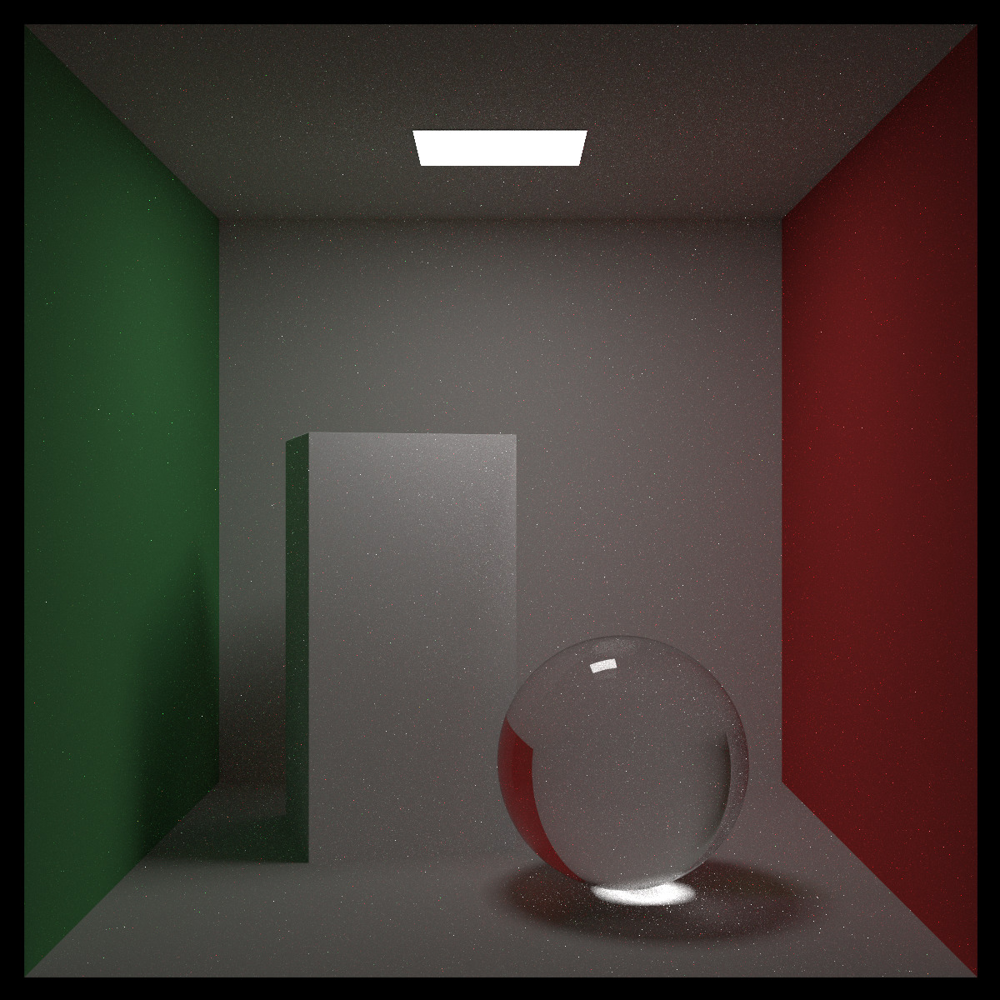

# Ray Tracing in One Weekend

[Ray Tracing in One Weekend](https://raytracing.github.io/books/RayTracingInOneWeekend.html) 的 Rust 语言实现。

## 运行

选择一个例子并使用命令行运行：

```bash
cargo run --release --example one_week
# 可选的例子名称:
#    one_week
#    the_next_week
#    the_rest_of_your_life
```

>这里推荐使用 `--release`，不然渲染花费的时间可能让人不能接受

## 概览

### Ray Tracing In One Weekend

</img>

### Ray Tracing The Next Week

</img>

### Ray Tracing The Rest of Your Life

</img>
